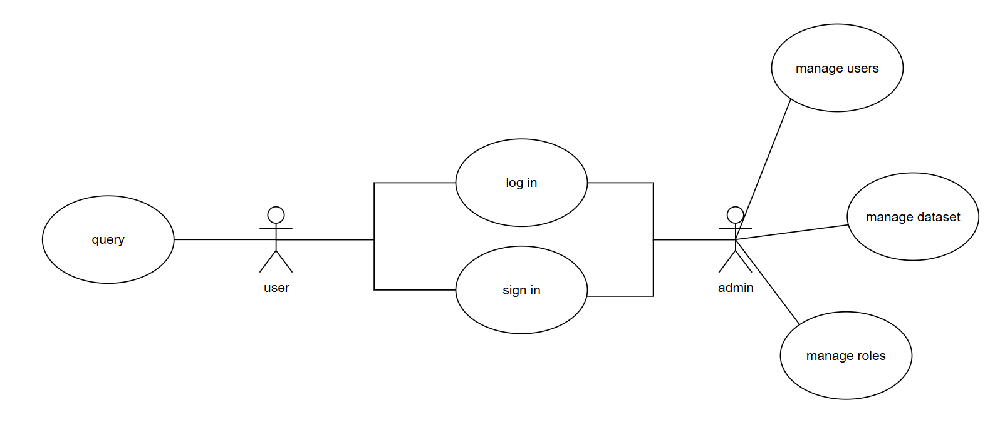

# ScholarAI

The system retrieves the most relevant and semantically similar news articles based on either a textual query or an uploaded PDF file. For PDF inputs, the system automatically extracts the document’s text before processing. A fine-tuned BERT model is then used to generate high-quality embeddings of the content, enabling accurate similarity computation and ranking of the most relevant news articles in the corpus.

# Architecture Diagram


# Use Case Diagram


# Project Structure
```base 
project/
├── client/         # Next.js (PNPM) frontend
├── server/
│   ├── users/      # FastAPI + Firebase Admin
│   ├── manage/     # FastAPI orchestrator for queries/PDFs
│   └── predict/    # ML model service (BERT prediction)
└── training/       # Model training & preprocessing notebooks
```
Description of each component:
- `client/` — Next.js frontend (PNPM). Provides UI, auth flows, and search interface.
- `server/` — Backend services:
	- `users/` — FastAPI + Firebase Admin; handles auth and user profiles. See `server/users/readme.md`.
	- `manage/` — FastAPI search orchestrator; handles queries/PDFs and calls predictor. See `server/manage/readme.md`.
	- `predict/` — ML assets (BERT news classification) and notes for running a predictor (often via Colab + ngrok). See `server/predict/readme.md`.
- `training/` — Notebooks for data preprocessing and model experiments.


# Environment & Secrets
- Each service has its own `.env` (copy from `*.env.example`).
- Sensitive files (e.g., `serviceAccountKey.json`) should not be committed publicly. The team stores shared secrets in Google Drive; replace `.example` files using items from the shared link: [Drive](https://drive.google.com/drive/folders/14mXVBw-TFMgtKJ3yng_V9HZ98oszseGo?usp=sharing).
- News_Category_Dataset_v3 datasets: [link](https://www.kaggle.com/datasets/linhtrnhong/News-Category-Dataset-v3/data).

Minimal env overview:
- `server/users/.env`: `API_KEY_FIREBASE` (Firebase Identity REST API key). Place `serviceAccountKey.json` in `server/users/`.
- `server/manage/.env`: `API_PREDICT` (HTTP URL to predictor service).
- `server/predict/.env.example`: optional tokens (e.g., HuggingFace, ngrok).

## Running with Docker Compose (recommended)

Prerequisites:
1. Start the predictor service on Google Colab.
2. Copy the public ngrok URL shown in Colab.
3. Update the `API_PREDICT` variable in server/manage/.env.

Start services:
```bash
docker compose up --build
```

Default ports:
- Client: `http://localhost:3000`
- Users service: `http://localhost:8000`
- Manage service: `http://localhost:8001`

Stop services:
```bash
docker compose down
```

## Running Locally without Docker
```bash
# client
cd client && npm run dev

# users service
cd server/users && uvicorn main:app --reload --host 0.0.0.0 --port 8000

# manage service
cd server/manage && uvicorn main:app --reload --host 0.0.0.0 --port 8001
```
Set `API_PREDICT` to your running predictor before testing manage endpoints.

